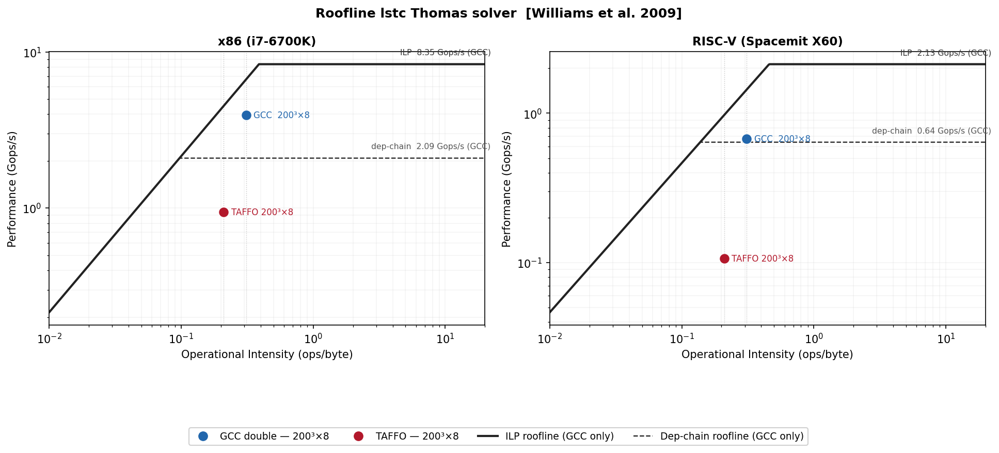

# Roofline Analysis — lstc Thomas Solver

The Roofline model [1,2] gives an upper bound on attainable performance as a function of a kernel's
operational intensity (OI),floating-point operations per byte of DRAM traffic after cache filtering.
The bound is:

```
Attainable GFlops/s = min(Peak FP performance, Peak DRAM BW × OI)
```

This yields the characteristic shape on a log-log plot: a diagonal slope (memory bound) that
flattens into a horizontal ceiling (compute bound) at the ridge point. The model provides an upper
bound; identifying the specific bottleneck within that regime requires profiling tools [3,4].
For RISC-V platforms, PMU counter availability varies by implementation and the SpacemiT X60 used
here has limited hardware counter support [5].


## Machine characterization

Peak DRAM bandwidth measured with STREAM triad (3 arrays × N × 8 bytes, N = 32M doubles,
heap-allocated to force DRAM traffic [1]).
Peak scalar FLOP/s measured with a scalar FMA micro-benchmark: dep-chain variant (latency-bound)
and 4-way ILP variant (throughput-bound), both `-O3 -ffast-math`.

| | x86 (i7-6700K) | RISC-V (Spacemit X60) |
|---|---|---|
| Peak DRAM bandwidth | 21.5 GB/s | 4.64 GB/s |
| Peak FLOP/s (dep-chain) | 2.09 GFLOP/s | 0.64 GFLOP/s |
| Peak FLOP/s (4-way ILP) | 8.35 GFLOP/s | 2.13 GFLOP/s |
| Compiler (baseline) | GCC 14, `-march=native` | GCC 13, `-march=rv64imafdcv_zicsr_zifencei` |

## Kernel characterization

### Data layout

`lstc` stores density as `dens[s*nx*ny*nz + x*ny*nz + y*nz + z]`.

| Sweep | Stride per element |
|---|---|
| z | 1 double | 
| y | nz doubles | 
| x | ny×nz doubles (320 KB at 200³×8) | 

### Operations per element

`lstc` stores precomputed reciprocals in `b[]` and `e[]` before the benchmark loop.

```
Forward:  d[i] = d[i] + e[i-1] * d[i-1]      1 FMA  = 2 ops
Backward: d[i] = (d[i] + c * d[i+1]) * b[i]  1 FMA + 1 MUL = 3 ops
Total: 5 ops per element
```

Both GCC and TAFFO solve the same Thomas problem with the same number of arithmetic steps.
Williams et al. [1] address the "model is limited to floating-point programs" fallacy directly:
the roofline can be applied to any operation count, replacing FLOPs with the relevant unit.
Here, 5 algorithmic operations per element is used uniformly.

For GCC these map to FP instructions (FMA + multiply); for TAFFO the Thomas loop uses
integer arithmetic (`imul`/`shr` on x86, `fcvt.d.wu`/`fmul.d` on RISC-V after
fixed-point conversion). The memory bandwidth ceiling applies to both.
The compute ceilings (dep-chain, ILP) apply to GCC only — they were measured with
FP FMA microbenchmarks and have no direct equivalent for TAFFO's integer path.

### Operational intensity

| | Bytes/element (DRAM) | OI (FLOP/byte) |
|---|---|---|
| GCC double | 16 (8 read + 8 write) | 0.31 |
| TAFFO | 24 (8 read + 4 copy-in write + 4 copy-out read + 8 write) | 0.21 |

OI is defined relative to DRAM traffic. At 50³×1 (~1 MB working set) the data fits in L3 cache,
so DRAM traffic is negligible, this is the reason why those kernels are not
plotted on the chart below.

## 50³ × 1 — L3 bound

Working set ~1 MB, fits in L3. The DRAM roofline does not apply; effective bandwidth is L3
bandwidth (not separately measured). Aggregate throughput = (3 × elements × 5 FLOPs) / total time.

| Solver | x86 (GFLOP/s) | RISC-V (GFLOP/s) |
|---|---|---|
| GCC double | 4.66 | 0.53 |
| TAFFO | 5.53 | 0.47 |

GCC vectorizes across independent yz rows (AVX on x86, RVV on RISC-V). TAFFO Thomas loops
are scalar on both platforms.


## 200³ × 8 — DRAM bound

Working set 512 MB, exceeds L3. OI = 0.31 (GCC) and 0.21 (TAFFO) are both below the ILP ridge
point (0.39 on x86, 0.46 on RISC-V) — kernels are in the memory-bound region.

Predicted ceiling = OI × Peak BW:
- GCC x86: 0.31 × 21.5 = 6.67 GFLOP/s
- TAFFO x86: 0.21 × 21.5 = 4.52 GFLOP/s
- GCC RISC-V: 0.31 × 4.64 = 1.44 GFLOP/s
- TAFFO RISC-V: 0.21 × 4.64 = 0.97 GFLOP/s

Aggregate throughput (all three sweeps combined):

| Solver | x86 (GFLOP/s) | Ceiling | Efficiency | RISC-V (GFLOP/s) | Ceiling | Efficiency |
|---|---|---|---|---|---|---|
| GCC double | 3.93 | 6.67 | 59% | 0.67 | 1.44 | 47% |
| TAFFO | 0.94 | 4.52 | 21% | 0.11 | 0.97 | 11% |



GCC sits between the dep-chain and ILP ceilings on both platforms: it vectorizes across
independent yz rows (AVX / RVV), exceeding the scalar dep-chain ceiling. TAFFO falls well
below the dep-chain ceiling despite scalar Thomas arithmetic — the bottleneck at this scale is
the strided copy-in (stride ny×nz×8 = 320 KB per element), which generates TLB misses on
every access and drives effective bandwidth far below peak.


## Summary

| | x86 50³ | x86 200³ | RISC-V 50³ | RISC-V 200³ |
|---|---|---|---|---|
| Regime | L3-bound | DRAM bound | L3-bound | DRAM bound |
| GCC efficiency | — | 47–94% of roofline | — | 36–58% |
| TAFFO vs GCC double | 1.19× faster | 4.2× slower | 0.89× | 6.3× slower |


## References

1. S. Williams, A. Waterman, D. Patterson. "Roofline: An Insightful Visual Performance Model for Floating-Point Programs and Multicore Architectures." CACM, 2009.
2. NERSC Roofline documentation. https://docs.nersc.gov/tools/performance/roofline/
3. T. zur. "The Roofline Model." https://tel-zur.net/blog/2024/03/20/the-roofline-model/
4. S. Lantz. "Introduction to Performance Optimization and Tuning Tools." CoDaS-HEP Summer School, Cornell University, 2023.
5. A. Batashev. "Dissecting RISC-V Performance: Practical PMU Profiling and Hardware-Agnostic Roofline Analysis on Emerging Platforms." arXiv:2507.22451, 2025.
